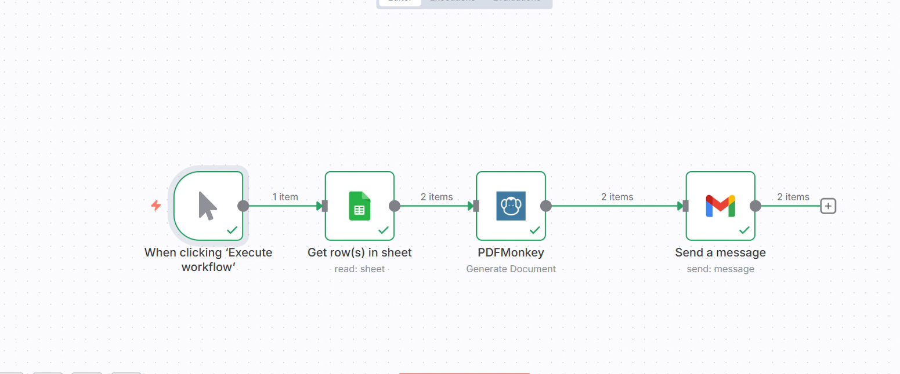

# 📄 Automated Invoice PDF Generator & Email Sender

---

## 🚀 **Overview**

This project automates **bill/invoice generation and email delivery** using a **workflow automation tool (n8n)**.

When executed, the system:

- 📥 Reads customer/order data from **Google Sheets**
- 📄 Generates **PDF invoices** using **PDFMonkey**
- 📧 Sends the generated PDF automatically via **Gmail**

### ✅ Benefits
- Fully automated
- Saves time
- Reduces human errors
- No manual invoice creation
- Easy to scale

---

## 🧩 **Workflow Architecture**

Trigger → Read Sheet → Generate PDF → Send Email

---

## 📸 **Workflow Screenshot**

---

## ⚙️ **Steps Explained**

### **1️⃣ Trigger – Execute Workflow**
- Manual or scheduled execution  
- Starts the automation process  

---

### **2️⃣ Google Sheets – Get Rows**
- Reads billing/customer details from sheet  
- Works as the main **data source**

Example data:

| Name | Email | Product | Amount | Invoice No |
|------|--------|-----------|-----------|-------------|

---

### **3️⃣ PDFMonkey – Generate Document**
- Creates dynamic PDF invoice  
- Uses sheet data to fill template  
- Auto-generates professional invoices  
- Output: **downloadable PDF**

---

### **4️⃣ Gmail – Send Message**
- Sends email to customer  
- Attaches generated invoice  
- Subject: **Invoice/Bill**  
- Body: **Payment details**

---

## 🛠️ **Tech Stack**

| **Tool** | **Purpose** |
|-----------|--------------------------|
| Google Sheets | Data source |
| PDFMonkey | PDF invoice generation |
| Gmail API | Email sending |
| n8n | Workflow automation |
